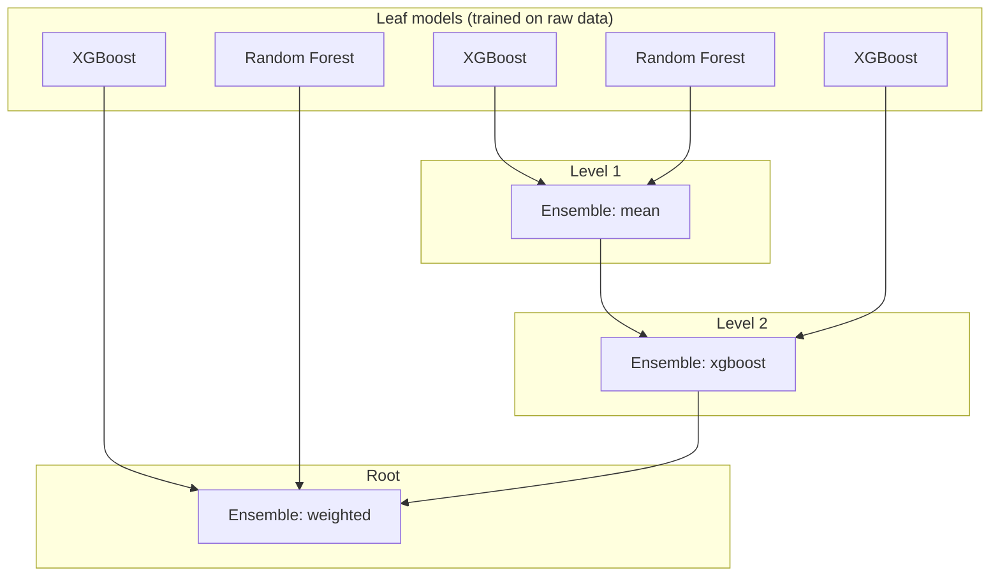
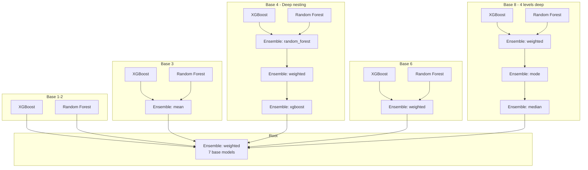

# Model Training

A declarative model training library that builds **arbitrary ensemble graphs** from nested YAML. Give it a dataset and a config—get a trained model. No code required for the pipeline structure.

## The Idea

Instead of wiring models in Python, you describe the full training graph in YAML. The system recursively trains base models, stacks them into ensembles, and supports unlimited nesting. A single config can define dozens of models across multiple levels.

## Quick Start

```bash
uv sync
python example_train.py
```

Or with a custom config:

```python
import yaml
from sklearn.datasets import make_classification
from train import train_from_config

with open("example_config.yaml") as f:
    config = yaml.safe_load(f)

X, y = make_classification(n_samples=1000, n_features=20, n_classes=2, random_state=42)
model = train_from_config(config, data=(X, y))
```

## Config → Training Graph

The key insight: **a nested YAML config is a DAG**. Leaf nodes are XGBoost or Random Forest trained on raw data. Internal nodes are ensembles that consume their children’s predictions. The root is your final model.

Here’s what `example_config.yaml` looks like as a Mermaid graph:



Data flows bottom-up: leaf models get `(X, y)`, produce predictions, and each ensemble combines its children’s outputs using its strategy.

## Config Schema

| Field | Required | Description |
|-------|----------|-------------|
| `model` | yes | `xgboost`, `random_forest`, or `ensemble` |
| `strategy` | for ensemble | `mean`, `median`, `mode`, `weighted`, `xgboost`, `random_forest` |
| `hyperparameters` | no | Model-specific params (e.g. `n_estimators`, `max_depth`) |
| `base_models` | for ensemble | List of nested configs |
| `train` | no | `true` (default) to train, `false` to load from `model_path` |
| `model_path` | when train=false | Path to saved model |

## Ensemble Strategies

- **mean / median / mode** — No extra training; combine predictions directly.
- **weighted** — Requires `weights` in hyperparameters (must sum to 1).
- **xgboost / random_forest** — Train a meta-model on base model predictions.

## Complex Graph Example

`doomed_config.yaml` shows how deep and wide a config can get—multiple nested ensembles, mixed strategies, and several base models. It’s intentionally invalid (wrong weights, missing fields) for tests, but the *structure* illustrates what’s possible:



Same idea: YAML describes the graph; the trainer walks it recursively.

## Adding New Classifiers

It’s straightforward to add new algorithms. Add a Pydantic model for hyperparameters, add a wrapper class with `fit`, `predict`, `score`, `load`, and `save`, then wire it into `train.py`. That’s it—no extra plumbing.

## Project Layout

| File | Purpose |
|------|---------|
| `algorithms.py` | XGBoost, Random Forest, and EnsembleModel implementations |
| `train.py` | `Config` schema and `train_from_config()` |
| `example_config.yaml` | Valid nested config |
| `doomed_config.yaml` | Intentionally broken config (for tests) |

## Requirements

Python ≥3.13. Dependencies: `numpy`, `pydantic`, `pyyaml`, `scikit-learn`, `xgboost`.
